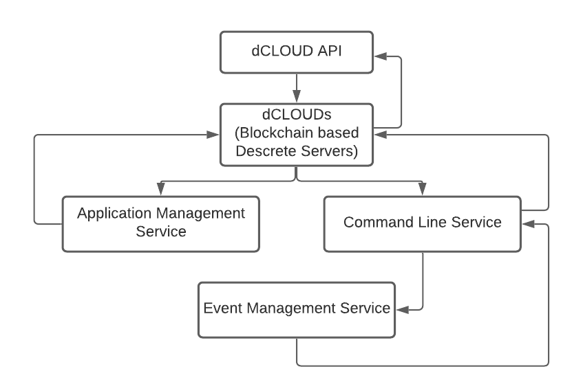

### Integrated Execution Mechanism (IEM) <!-- {docsify-ignore} -->

As mentioned earlier, on top of a random accession program, the framework allows users
to point all the requests towards an anonymous dCLOUD which attaches the remotely
available web resources to users hardwares thereby performs the tasks on mix & match
basis.

**Steps...**

**Step 1:** API call is routed to the dCLOUDs the Web Console is pointing to.

**Step 2:** dCLOUDS determines whether the API can bypass authentication. If the API cannot
bypass authentication, the login/token that are passed are validated based on the token
type. Also input validation is done. Depending on the API, the call is routed to the
Application Manager service or the Command Line service.

**Step 3:** 

**3a:** If the API is routed to the Application Manager service, the Application Manager
service processes the request from the dCLOUDS, authenticates whether the user has the
authority to perform the specified action, performs the action, and then depending on the
action, stores audit information and/or sends an alert. Then the response is returned to
dCLOUDS.

**3b.1:** If the API is routed to Command Line service, the Command Line service validates the
token and sends the request to the Server Event Manager service on the user's device.

**3b.2:** The Server Event Manager service processes the request from the Command Line
service, authenticates whether the user has the authority to perform the specified action,
performs the action, and then depending on the action, stores audit information and/or
sends an alert. The response is returned to the Command Line service which returns the
response to dCLOUDS.

**Step 4:** The dCLOUDS processes the response from the Application Manager service or the
Command Line service, sets the exit code and the HTTP status code, formats the response
in XML or JSON format depending on the REST API request, and then sends it back to the
caller.

 -->
