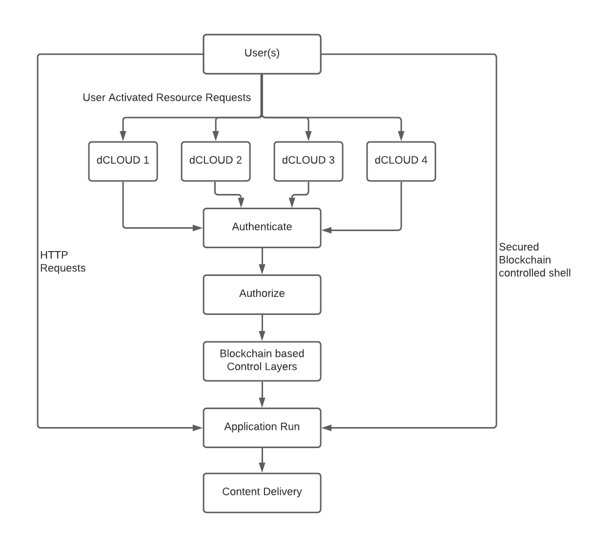

### Performance Identification Application (PIA) <!-- {docsify-ignore} -->

A logically inferred program is integrated to each & every dCLOUD whereby the user
requests are divided into a number of Blocks and attached henceforth to a minimum of 4
dCLOUDS. These requests then processed in identified dCLOUDS and diverted to the
targeted device anonymously to be delivered in a predefined time interval.

 -->
