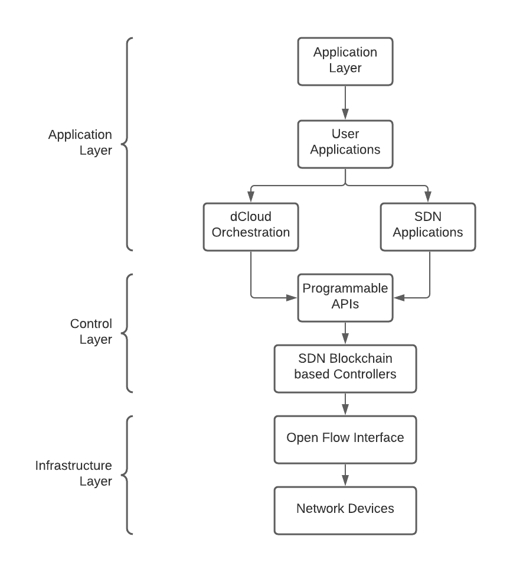

### Software-Defined Network <!-- {docsify-ignore} -->

Adoption of the concepts of “inter-connected data centers” and “server virtualization” has
increased network demand tremendously.

In addition to various proprietary network hardware, distributed protocols, and software
components, legacy networks are inundated with switching devices that decide on the
route taken by each packet individually; moreover, the data paths and the decision-making
processes for switching or routing are collocated on the same device

 -->

By implementing a new orchestration level, SDN can tackle the inflexibility and complexity
of the traditional network. SDN provides enterprises with the ability to control their
networks programmatically and to scale them without affecting performance, reliability, or
the user experience.
OpenFlow is the protocol used for managing the southbound interface of the generalized
SDN architecture.
The controller is responsible for maintaining all the network protocols and policies and
distributing appropriate instructions to the network devices.
